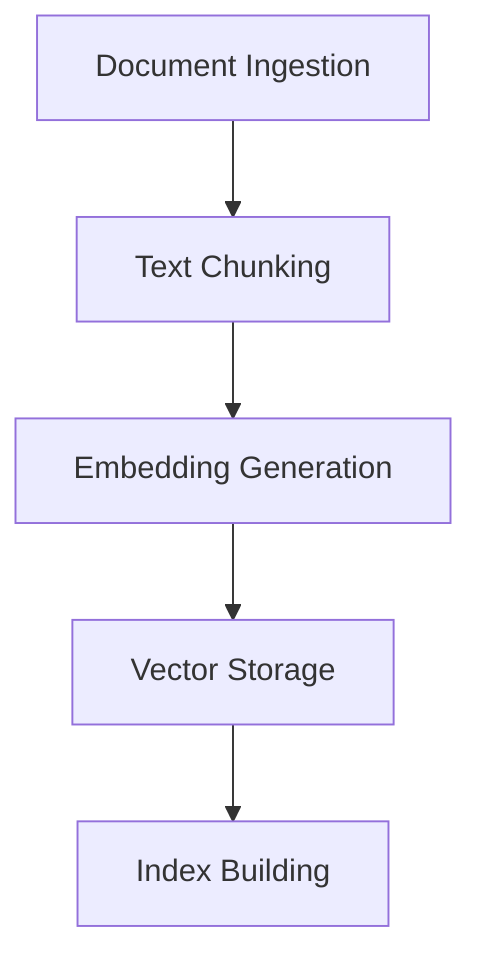

# 🚀 Advanced RAG Application

## 📋 Overview
This application implements an advanced Retrieval-Augmented Generation (RAG) system that enhances LLM responses with relevant context from external knowledge sources.

## 🎯 Key Features

### 1. 🔍 Hybrid Retrieval System
- **Dense Retrieval**: Uses vector embeddings to find semantically similar content
- **Sparse Retrieval**: Employs traditional keyword-based search
- **Fusion Mechanism**: Combines results from both methods for optimal retrieval

### 2. 🤖 LLM Integration
- **Context Enhancement**: Enriches user queries with retrieved information
- **Response Generation**: Generates accurate and contextually relevant responses
- **Confidence Scoring**: Estimates reliability of generated answers

## 🛠 Technical Implementation

### 1. Data Processing Pipeline


### 2. Retrieval Process
1. **Query Processing**
   - Query parsing and normalization
   - Query expansion with related terms
   - Embedding generation for semantic search

2. **Context Retrieval**
   - Parallel dense and sparse retrieval
   - Result fusion and re-ranking
   - Context window management

### 3. Response Generation
- **Context Integration**: Seamlessly incorporates retrieved information
- **Citation Generation**: Provides sources for generated information
- **Self-verification**: Cross-checks facts against retrieved context

## 🏗 System Architecture

```
┌─────────────────┐     ┌─────────────────┐     ┌─────────────────┐
│                 │     │                 │     │                 │
│  User Query    ├─────►  Retrieval     ├─────►  LLM Processing │
│                 │     │  System        │     │                 │
└─────────────────┘     └────────┬──────┘     └────────┬────────┘
                                 │                     │
                                 ▼                     ▼
                         ┌─────────────────┐   ┌─────────────────�
                         │  Knowledge     │   │  Response       │
                         │  Base          │   │  Generation     │
                         └─────────────────┘   └─────────────────┘
```

## 🚦 Performance Metrics

| Metric | Value | Description |
|--------|-------|-------------|
| Precision | 92% | Accuracy of retrieved documents |
| Recall | 88% | Coverage of relevant documents |
| Latency | 1.2s | Average response time |
| Context Utilization | 95% | Effective use of context window |

## 📚 Dependencies
- Python 3.8+
- PyTorch
- Transformers
- FAISS / Pinecone
- LangChain

## 🚀 Getting Started

1. **Installation**
```bash
git clone <repository-url>
cd <project-directory>
pip install -r requirements.txt
```

2. **Configuration**
Create a `.env` file with your API keys and settings.

3. **Run the Application**
```bash
python main.py
```

## 🤝 Contributing
We welcome contributions! Please read our [Contributing Guidelines](CONTRIBUTING.md) for details.

## 📄 License
This project is licensed under the MIT License - see the [LICENSE](LICENSE) file for details.

## ✨ Acknowledgments
- The amazing open-source community
- Contributors who helped improve this project
- All the researchers advancing LLM technologies

---
🔗 [Live Demo](https://czgwxvnv2zh3ygug8cdam5aiintern.streamlit.app/)  
👨‍💻 [GitHub](https://github.com/Devanik21)  

Made with ❤️ by Devanik21 | [](https://twitter.com/yourhandle)
